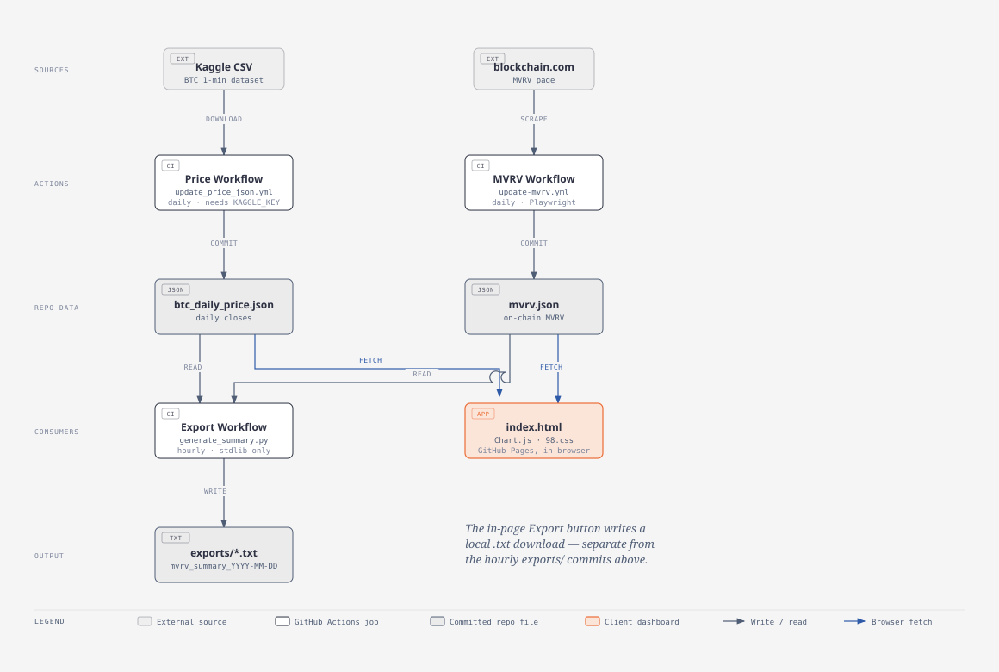

MVRV Analytics Dashboard
========================
https://0xtrvkc.github.io/dynamic-btc-analytics-dashboard/

Bitcoin on-chain cycle analysis. Entirely client-side.
No backend, no database, no login.

WHAT IT DOES
------------
Loads MVRV data + historical price data, then throws a bunch of
cycle analysis at you:

  - Z-score (rolling 365-day window, not all-time — avoids 2011 anchoring)
  - All halving cycles overlaid on one chart
  - MA20/50/200 with crossover events flagged
  - 30d and 90d rate-of-change momentum
  - Peak drawdown per cycle
  - Price projections via 4 independent models:
      - MVRV Upside        (price at MVRV peak × median remaining upside)
      - Halving Multiplier (halving price × log-decay fitted multiplier)
      - ATH Multiplier     (prev ATH × log-decay ratio)
      - MVRV × Realized Cap
    IQR consensus across those four. Outliers get dropped automatically.
  - Backtest tab — every model re-run with no-lookahead on completed cycles
    so you can see whether any of this actually works historically

Export button spits out a .txt summary you can paste into an LLM
or just keep as a timestamped record.

FILES
-----
index.html                   The whole app. All logic lives here.
btc_daily_price.json         Daily BTC closes. Auto-updated by CI.
mvrv.json                    MVRV data. Auto-updated by CI (blockchain.com scrape).
generate_price_json.py       Price data refresh script (called by Actions).
generate_summary.py          Headless port of the export function. No deps.
exports/                     Auto-exported summaries, one .txt per day.

.github/workflows/
  update_price_json.yml      Daily — downloads Kaggle CSV, regenerates price JSON.
  update-mvrv.yml            Daily — Playwright scrapes blockchain.com for MVRV.
  auto_export_summary.yml    Hourly — runs generate_summary.py, commits to exports/.

HOW DATA GETS IN
----------------
MVRV data:
  The dashboard can load a JSON you manually export from blockchain.com,
  OR it auto-fetches mvrv.json straight from this repo (already there).
  The CI scrape keeps mvrv.json current daily so you don't have to touch it.

Price data:
  btc_daily_price.json is rebuilt daily from the Kaggle BTC 1-min dataset.
  Requires KAGGLE_USERNAME and KAGGLE_KEY in repo secrets.
  Without those secrets the price workflow will fail — everything else still works,
  you just lose the price overlay.

DATA FLOW
---------

  Kaggle + blockchain.com feed two daily workflows that commit JSON to the
  repo; an hourly workflow reads that JSON to write exports/*.txt, and
  index.html fetches the same JSON straight in the browser (no backend).

  Note: the in-page Export button writes a local .txt download. That's separate
  from the exports/*.txt files committed by auto_export_summary.yml above.

AUTO-EXPORT
-----------
generate_summary.py runs every hour via GitHub Actions.
Reads mvrv.json + btc_daily_price.json, computes the same stats as the
browser export, writes exports/mvrv_summary_YYYY-MM-DD.txt.

Once a day's file exists it won't overwrite it.
No secrets needed. Runtime is ~4 seconds.

To deploy: drop generate_summary.py in repo root and add
auto_export_summary.yml to .github/workflows/. That's it.

CONFIG
------
All the tunable knobs are at the top of index.html:

  ZSCORE_WINDOW: 365          rolling window for z-score (days)
  ZSCORE_CAPITULATION: -1.5   below this = capitulation signal
  ZSCORE_CAUTION: 1.0         above this = caution signal
  ROC_SHORT: 30               short momentum window (days)
  ROC_LONG: 90                long momentum window (days)
  AVG_CYCLE_DAYS: 1422        fallback interval only when no next estimate exists

The first four cycle starts are fixed to the UTC dates of blocks 210,000,
420,000, 630,000 and 840,000. Future dates shown in Cycle dates are estimates,
not new-cycle boundaries. On page load, the browser checks mempool.space and
Blockstream for the next 210,000-block boundary; both must report the same
hash and timestamp with six later blocks before the new cycle begins.
The scheduled Python export uses the same block rule independently. If the
explorers are unavailable, the last confirmed cycle remains active and the
next date remains an estimate. Browser-confirmed dates are saved locally;
the scheduled export checks the chain again on each run.

In Cycle Overlay, the return heatmap defaults to calendar months since each
confirmed halving, with a switch to six-month windows. On desktop, the compact
monthly grid fits the available width; on mobile it scrolls horizontally.
Monthly cells omit the percent sign and round values to save space; hover or
select one for its precise return. Select any cell to inspect its exact UTC window, price
dates, daily path, running drawdown, volatility, MVRV change, data coverage,
and return relative to completed historical cycles. The unfinished live window
is labeled "so far" and compared at the same elapsed day in prior cycles.
Each cell shows the return within its window, rather than the cumulative gain
since halving. Future months appear as new daily prices arrive; if a halving
occurs later than month 48, the heatmap adds more columns. Historical ranks have only a
few prior cycles and are descriptive, not predictive.

STACK
-----
Vanilla JS. Chart.js 4.4. 98.css for the UI chrome.
Python 3.11 for the CI scripts (stdlib only — no pip install for generate_summary.py).
GitHub Actions for all automation.

No build step. No node_modules. index.html just works.

NOT FINANCIAL ADVICE.
